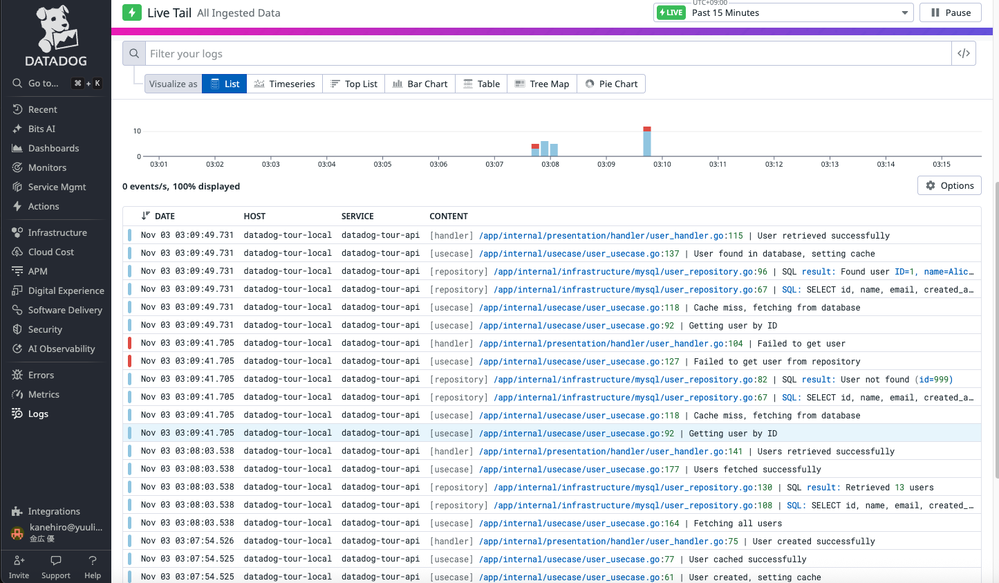

# Datadog APM: TraceとSpanの完全ガイド

## 目次
1. [TraceとSpanとは](#traceとspanとは)
2. [実装方法（Go）](#実装方法go)
3. [ログとの統合](#ログとの統合)
4. [Log Explorer Fields & Attributesの設定](#log-explorer-fields--attributesの設定)
5. [Datadogでの確認方法](#datadogでの確認方法)
6. [ベストプラクティス](#ベストプラクティス)
7. [トラブルシューティング](#トラブルシューティング)

---

## TraceとSpanとは

### Trace（トレース）
**1つのリクエストが複数のサービスや処理を通過する際の全体の流れ**を表します。

- 一意の**Trace ID**で識別される（例：`1234567890`）
- 複数のSpanで構成される
- リクエストの開始から終了までの全体を追跡

**例：ユーザー作成リクエストのTrace**
```
クライアント → API Gateway → Handler → UseCase → Repository → MySQL
                  ↑____________このリクエスト全体が1つのTrace____________↑
```

### Span（スパン）
**Traceを構成する個々の処理単位**を表します。

- 各Spanは一意の**Span ID**を持つ
- 親子関係を持つ（**Parent Span ID**）
- 処理の開始・終了時刻と継続時間を記録
- メタデータ（タグ）を持つ

**例：各処理がSpan**
```
Span 1: handler.create_user    [200ms] ← 親Span
Span 2: usecase.create_user    [180ms] ← Span 1の子
Span 3: mysql.create_user      [100ms] ← Span 2の子
Span 4: db.ExecContext         [90ms]  ← Span 3の子
Span 5: redis.set_cache        [50ms]  ← Span 2の子
```

### TraceとSpanの関係（視覚化）

```
Trace ID: 1234567890 (1つのリクエスト全体)
│
├─ Span: handler.create_user [200ms]  ← Root Span
│  Span ID: 111, Parent: null
│  │
│  ├─ Span: usecase.create_user [180ms]
│  │  Span ID: 222, Parent: 111
│  │  │
│  │  ├─ Span: mysql.create_user [100ms]
│  │  │  Span ID: 333, Parent: 222
│  │  │  │
│  │  │  └─ Span: db.ExecContext [90ms]
│  │  │     Span ID: 444, Parent: 333
│  │  │
│  │  └─ Span: redis.set_cache [50ms]
│  │     Span ID: 555, Parent: 222
```

### Spanに含まれる主な情報

| フィールド | 説明 | 例 |
|----------|------|-----|
| **Trace ID** | このSpanが属するTraceの識別子 | `1234567890` |
| **Span ID** | このSpanの識別子 | `111` |
| **Parent Span ID** | 親Spanの識別子 | `null`（Root Span） |
| **Operation Name** | 処理の名前 | `handler.create_user` |
| **Service Name** | サービス名 | `datadog-tour-api` |
| **Resource** | リソース名 | `POST /api/users` |
| **Duration** | 処理時間 | `200ms` |
| **Start Time** | 開始時刻 | `2025-11-03T01:00:00Z` |
| **Tags** | メタデータ | `user.id=123, error=true` |

---

## 実装方法（Go）

### 1. 初期設定（main.go）

```go
package main

import (
    "os"
    "gopkg.in/DataDog/dd-trace-go.v1/ddtrace/tracer"
)

func main() {
    // Datadog Tracerの初期化
    // これによりDatadog Agent（localhost:8126）に接続
    tracer.Start(
        tracer.WithEnv(os.Getenv("DD_ENV")),           // 環境名（production, staging等）
        tracer.WithService(os.Getenv("DD_SERVICE")),   // サービス名
        tracer.WithServiceVersion(os.Getenv("DD_VERSION")), // バージョン
        tracer.WithLogStartup(true),
    )
    defer tracer.Stop()

    // アプリケーション起動
    startServer()
}
```

### 2. HTTP Handlerでの基本的なSpan作成

```go
package handler

import (
    "net/http"
    "gopkg.in/DataDog/dd-trace-go.v1/ddtrace/tracer"
)

func (h *UserHandler) CreateUser(w http.ResponseWriter, r *http.Request) {
    // 親Spanの作成（HTTP RequestのcontextからSpanを生成）
    span, ctx := tracer.StartSpanFromContext(r.Context(), "handler.create_user")
    defer span.Finish()  // 処理完了時にDatadog Agentへ送信

    // Spanにメタデータを追加
    span.SetTag("http.method", r.Method)
    span.SetTag("http.url", r.URL.Path)
    span.SetTag("http.user_agent", r.UserAgent())

    // ビジネスロジック実行（ctxを渡す）
    user, err := h.userUseCase.CreateUser(ctx, req.Name, req.Email)
    if err != nil {
        span.SetTag("error", true)
        span.SetTag("error.msg", err.Error())
        http.Error(w, "Failed to create user", http.StatusInternalServerError)
        return
    }

    // 成功時のメタデータ
    span.SetTag("user.id", user.ID)

    w.WriteHeader(http.StatusCreated)
    json.NewEncoder(w).Encode(user)
}
```

### 3. 子Spanの作成（UseCase層）

```go
package usecase

import (
    "context"
    "gopkg.in/DataDog/dd-trace-go.v1/ddtrace/tracer"
)

func (uc *UserUseCase) CreateUser(ctx context.Context, name, email string) (*domain.User, error) {
    // 親Spanのcontextから子Spanを作成
    span, ctx := tracer.StartSpanFromContext(ctx, "usecase.create_user")
    defer span.Finish()

    // ビジネスメタデータを追加
    span.SetTag("user.name", name)
    span.SetTag("user.email", email)

    user := &domain.User{
        Name:      name,
        Email:     email,
        CreatedAt: time.Now(),
    }

    // Repository呼び出し（さらに子Spanが作成される）
    if err := uc.userRepo.Create(ctx, user); err != nil {
        span.SetTag("error", true)
        span.SetTag("error.msg", err.Error())
        return nil, err
    }

    span.SetTag("user.id", user.ID)
    return user, nil
}
```

### 4. Decorator Patternでトレーシングを分離

**ビジネスロジックとトレーシング責務を分離する推奨パターン**

```go
// internal/infrastructure/tracing/user_repository.go
package tracing

import (
    "context"
    "gopkg.in/DataDog/dd-trace-go.v1/ddtrace/tracer"
    "github.com/kanehiroyuu/datadog-tour/internal/domain"
)

// UserRepositoryTracerはUserRepositoryをラップしてトレーシング機能を追加
type UserRepositoryTracer struct {
    repo domain.UserRepository  // 実際のRepository
}

func NewUserRepositoryTracer(repo domain.UserRepository) *UserRepositoryTracer {
    return &UserRepositoryTracer{repo: repo}
}

// CreateはRepositoryのCreate処理をトレーシング
func (r *UserRepositoryTracer) Create(ctx context.Context, user *domain.User) error {
    // Spanの作成（データベース操作のトレース）
    span, ctx := tracer.StartSpanFromContext(ctx, "mysql.create_user")
    defer span.Finish()

    // データベース操作のメタデータ
    span.SetTag("db.type", "mysql")
    span.SetTag("db.operation", "INSERT")
    span.SetTag("db.table", "users")
    span.SetTag("user.name", user.Name)
    span.SetTag("user.email", user.Email)

    // 実際のRepository処理を実行
    err := r.repo.Create(ctx, user)

    if err != nil {
        span.SetTag("error", true)
        span.SetTag("error.msg", err.Error())
        return err
    }

    span.SetTag("user.id", user.ID)
    return nil
}
```

**main.goでの使用例**
```go
// ベースRepositoryの作成（トレーシングなし）
userRepoBase := mysql.NewUserRepository(db, logger)

// Tracerでラップ
userRepo := tracing.NewUserRepositoryTracer(userRepoBase)

// UseCaseに渡す
userUseCase := usecase.NewUserUseCase(userRepo, cacheRepo, logger)
```

**メリット**:
- ビジネスロジックがクリーンに保たれる
- トレーシングのON/OFFが簡単
- テスト時にトレーシングなしのRepositoryを使用可能

---

## ログとの統合

### TraceとLogの紐付け

Trace IDとSpan IDをログに埋め込むことで、DatadogでログとTraceを統合表示できます。

```go
// internal/common/logging/logger.go
package logging

import (
    "context"
    "github.com/sirupsen/logrus"
    "gopkg.in/DataDog/dd-trace-go.v1/ddtrace/tracer"
)

// LogWithTraceはTrace情報を含むログを出力
func LogWithTrace(ctx context.Context, logger *logrus.Logger, layer, message string, fields logrus.Fields) {
    if fields == nil {
        fields = logrus.Fields{}
    }

    // Contextからtrace情報を取得
    if span, ok := tracer.SpanFromContext(ctx); ok {
        spanContext := span.Context()
        fields["dd.trace_id"] = spanContext.TraceID()  // ← Trace ID
        fields["dd.span_id"] = spanContext.SpanID()    // ← Span ID
    }

    // 層情報を追加
    fields["layer"] = layer

    // メッセージに層プレフィックスを追加
    formattedMessage := fmt.Sprintf("[%s] %s", layer, message)

    logger.WithFields(fields).Info(formattedMessage)
}
```

**使用例**
```go
func (h *UserHandler) CreateUser(w http.ResponseWriter, r *http.Request) {
    span, ctx := tracer.StartSpanFromContext(r.Context(), "handler.create_user")
    defer span.Finish()

    // ログにTrace IDとSpan IDが自動的に含まれる
    logging.LogWithTrace(ctx, h.logger, "handler", "Creating user", logrus.Fields{
        "user.name": req.Name,
    })

    // 出力例：
    // {
    //   "dd.trace_id": 1234567890,
    //   "dd.span_id": 111,
    //   "layer": "handler",
    //   "user.name": "John Doe",
    //   "msg": "[handler] Creating user"
    // }
}
```

### レスポンスヘッダーにTrace IDを追加

クライアント側でエラー報告時にTrace IDを送れるようにします。

```go
// internal/presentation/handler/response.go
package handler

import (
    "context"
    "fmt"
    "net/http"
    "gopkg.in/DataDog/dd-trace-go.v1/ddtrace/tracer"
)

func RespondJSONWithTrace(ctx context.Context, w http.ResponseWriter, status int, data interface{}) {
    // Trace IDをレスポンスヘッダーに追加
    if span, ok := tracer.SpanFromContext(ctx); ok {
        spanContext := span.Context()
        w.Header().Set("X-Datadog-Trace-Id", fmt.Sprintf("%d", spanContext.TraceID()))
        w.Header().Set("X-Datadog-Span-Id", fmt.Sprintf("%d", spanContext.SpanID()))
    }

    w.Header().Set("Content-Type", "application/json")
    w.WriteHeader(status)
    json.NewEncoder(w).Encode(data)
}
```

---

## Log Explorer Fields & Attributesの設定

Datadog Log Explorerに表示される **Fields & Attributes**（`error`, `file`, `layer`, `level`, `line` など）は、以下の3つの場所で設定されています。

### 1. アプリケーションコードで設定

**場所**: `internal/common/logging/logger.go`

ログ出力時に自動的に追加されるフィールドです。

```go
// internal/common/logging/logger.go
package logging

import (
    "context"
    "fmt"
    "runtime"
    "github.com/sirupsen/logrus"
    "gopkg.in/DataDog/dd-trace-go.v1/ddtrace/tracer"
)

func LogErrorWithTrace(ctx context.Context, logger logrus.FieldLogger, layer, message string, err error, fields logrus.Fields) {
    if fields == nil {
        fields = logrus.Fields{}
    }

    // 呼び出し元の情報を自動取得（runtime.Caller）
    _, file, line, ok := runtime.Caller(2)
    if ok {
        fields["file"] = file  // ← ファイルパス
        fields["line"] = line  // ← 行番号
    }

    // Contextからtrace情報を取得
    if span, ok := tracer.SpanFromContext(ctx); ok {
        spanContext := span.Context()
        fields["dd.trace_id"] = spanContext.TraceID()  // ← Trace ID
        fields["dd.span_id"] = spanContext.SpanID()    // ← Span ID
    }

    fields["layer"] = layer  // ← "handler", "usecase", "repository"など

    // エラーオブジェクトから自動的に "error" フィールドが追加される
    logger.WithFields(fields).WithError(err).Error(formattedMessage)
    //                         ^^^^^^^^^^^^^^
    //                         これにより "error" フィールドが追加される
}
```

**自動的に追加されるフィールド:**

| フィールド名 | 取得元 | 説明 | 例 |
|------------|--------|------|-----|
| **file** | `runtime.Caller(2)` | 呼び出し元のファイルパス | `/usr/local/go/src/net/http/server.go` |
| **line** | `runtime.Caller(2)` | 呼び出し元の行番号 | `2141` |
| **layer** | 引数で指定 | アーキテクチャ層 | `handler`, `usecase`, `repository` |
| **dd.trace_id** | `tracer.SpanFromContext(ctx)` | Datadog Trace ID | `2532593448861146015` |
| **dd.span_id** | `tracer.SpanFromContext(ctx)` | Datadog Span ID | `3920137683431479689` |
| **error** | `WithError(err)` | エラーメッセージ | `simulated database connection error` |

**使用例:**

```go
// internal/presentation/handler/test_handler.go
func (h *TestHandler) ErrorEndpoint(w http.ResponseWriter, r *http.Request) {
    span, ctx := tracer.StartSpanFromContext(r.Context(), "handler.error_endpoint")
    defer span.Finish()

    logger := appcontext.GetLogger(ctx)
    err := errors.New("simulated database connection error")

    // この呼び出しで上記のフィールドが全て自動設定される
    logging.LogErrorWithTrace(ctx, logger, "handler", "Simulated error occurred", err, nil)
}
```

### 2. Logrusライブラリが自動設定

**場所**: `cmd/api/main.go`

```go
// cmd/api/main.go
func init() {
    logger = logrus.New()
    logger.SetFormatter(&logrus.JSONFormatter{})  // ← JSON形式で出力
    logger.SetOutput(os.Stdout)
    logger.SetLevel(logrus.InfoLevel)
}
```

**Logrusが自動的に追加するフィールド:**

| フィールド名 | 説明 | 例 |
|------------|------|-----|
| **level** | ログレベル | `error`, `info`, `warn`, `debug` |
| **time** | タイムスタンプ | `2025-11-05T06:10:49Z` |
| **msg** | ログメッセージ | `[handler] Simulated error occurred` |

### 3. Datadog Agentが自動解析

**場所**: `docker/docker-compose.yml`

```yaml
# docker/docker-compose.yml
services:
  api:
    container_name: datadog-api
    environment:
      - DD_ENV=development
      - DD_SERVICE=datadog-tour-api
      - DD_VERSION=1.0.0
    labels:
      # Datadog Agentがログを収集する際の設定
      com.datadoghq.ad.logs: '[{"source": "golang", "service": "datadog-tour-api"}]'
```

**Datadog Agentが自動的に追加するフィールド:**

| フィールド名 | 取得元 | 説明 | 例 |
|------------|--------|------|-----|
| **service** | `DD_SERVICE`環境変数 または labels | サービス名 | `datadog-tour-api` |
| **source** | labels | ログのソース言語 | `golang` |
| **host** | `DD_HOSTNAME`環境変数 | ホスト名 | `datadog-tour-local` |
| **container_name** | Dockerコンテナ名 | コンテナ名 | `datadog-api` |
| **env** | `DD_ENV`環境変数 | 環境名 | `development` |

### カスタムフィールドの追加方法

独自のフィールドを追加したい場合は、`fields`引数に`logrus.Fields`を渡します。

```go
// カスタムフィールドを追加
logging.LogErrorWithTrace(ctx, logger, "handler", "User creation failed", err, logrus.Fields{
    "user_id": 123,               // カスタム: ユーザーID
    "request_id": "abc-123",      // カスタム: リクエストID
    "client_ip": "192.168.1.1",   // カスタム: クライアントIP
    "user_agent": "Mozilla/5.0",  // カスタム: ユーザーエージェント
})
```

**出力されるJSON:**

```json
{
  "dd.trace_id": 2532593448861146015,
  "dd.span_id": 3920137683431479689,
  "file": "/app/internal/presentation/handler/user_handler.go",
  "line": 42,
  "layer": "handler",
  "level": "error",
  "time": "2025-11-05T06:10:49Z",
  "msg": "[handler] User creation failed",
  "error": "database connection timeout",
  "user_id": 123,
  "request_id": "abc-123",
  "client_ip": "192.168.1.1",
  "user_agent": "Mozilla/5.0",
  "service": "datadog-tour-api",
  "source": "golang",
  "host": "datadog-tour-local"
}
```

これら全てのフィールドがDatadog Log Explorerの **Fields & Attributes** タブに表示され、フィルタリングや検索に使用できます。

### Fields & Attributesの表示確認

**Log Explorerでの確認手順:**

1. Datadog → Logs → Log Explorer
2. ログ行をクリックして詳細を表示
3. **Fields & Attributes** タブをクリック
4. 上記のフィールドが全て表示されることを確認



---

## Datadogでの確認方法

### 1. APM Tracesでの確認

**アクセス方法**:
```
Datadog → APM → Traces
```

**Flame Graphの見方**:
```
横幅 = 処理時間の割合
縦   = 呼び出し階層（下が親、上が子）

例：
┌─────────────────────────────────────┐
│ handler.create_user [200ms]         │ ← 親Span（最も長い）
│ ┌─────────────────────────────────┐ │
│ │ usecase.create_user [180ms]     │ │ ← 子Span
│ │ ┌─────────────┐ ┌─────┐         │ │
│ │ │mysql [100ms]│ │redis│         │ │ ← 孫Span（並列実行）
│ │ └─────────────┘ └─────┘         │ │
│ └─────────────────────────────────┘ │
└─────────────────────────────────────┘
```

### 2. Spanの詳細情報

**各Spanをクリックすると表示される情報**:
- **Duration**: 処理時間
- **Tags**: 設定したメタデータ
  - `http.method`: POST
  - `user.id`: 123
  - `error`: true
- **Logs**: このSpanに紐づくログ（`dd.span_id`で紐付け）
- **Code**: ソースコード情報（有効化している場合）

### 3. Trace IDでログを検索

**手順**:
1. APM → Traces → 調査したいTraceを選択
2. Trace IDをコピー（例：`1234567890`）
3. Logs → 検索バーに `dd.trace_id:1234567890` と入力
4. 該当Traceの全ログが時系列で表示される

**結果例**:
```
[handler] Creating user              | dd.trace_id: 1234567890, dd.span_id: 111
[usecase] Creating user              | dd.trace_id: 1234567890, dd.span_id: 222
[repository] Executing SQL query     | dd.trace_id: 1234567890, dd.span_id: 333
[repository] User created in database| dd.trace_id: 1234567890, dd.span_id: 333
[usecase] User cached successfully   | dd.trace_id: 1234567890, dd.span_id: 222
[handler] User created successfully  | dd.trace_id: 1234567890, dd.span_id: 111
```

### 4. ログからTraceへの移動

**手順**:
1. Logs → エラーログを検索
2. ログ行をクリックして詳細を表示
3. 右パネルの `dd.trace_id` フィールドをクリック
4. 該当TraceのFlame Graphが表示される

---

## ベストプラクティス

### 1. Span名の命名規則

```go
// 良い例: 層.操作名
"handler.create_user"
"usecase.validate_order"
"mysql.insert_user"
"redis.get_cache"

// 悪い例: 曖昧すぎる
"process"
"handle"
"do_something"
```

### 2. 適切なタグの設定

```go
// 必須タグ
span.SetTag("http.method", "POST")           // HTTPメソッド
span.SetTag("http.url", "/api/users")        // URL
span.SetTag("error", true)                   // エラー発生時
span.SetTag("error.msg", err.Error())        // エラーメッセージ

// ビジネスタグ
span.SetTag("user.id", 123)                  // ユーザーID
span.SetTag("order.id", 456)                 // 注文ID
span.SetTag("payment.amount", 1000)          // 金額

// データベースタグ
span.SetTag("db.type", "mysql")              // DB種別
span.SetTag("db.operation", "INSERT")        // 操作種別
span.SetTag("db.table", "users")             // テーブル名
span.SetTag("db.row_count", 10)              // 取得行数

// 避けるべき: 機密情報
span.SetTag("password", "secret123")         // NG: パスワード
span.SetTag("credit_card", "1234-5678")      // NG: クレカ番号
```

### 3. エラーハンドリング

```go
func (uc *UserUseCase) CreateUser(ctx context.Context, name, email string) (*domain.User, error) {
    span, ctx := tracer.StartSpanFromContext(ctx, "usecase.create_user")
    defer span.Finish()

    user, err := uc.userRepo.Create(ctx, &domain.User{Name: name, Email: email})
    if err != nil {
        // エラー情報をSpanに記録
        span.SetTag("error", true)
        span.SetTag("error.msg", err.Error())
        span.SetTag("error.type", "database_error")

        // ログにも記録
        logging.LogErrorWithTrace(ctx, uc.logger, "usecase", "Failed to create user", err, nil)

        return nil, err
    }

    return user, nil
}
```

### 4. Spanの粒度

```go
// 適切な粒度: 意味のある処理単位
func ProcessOrder(ctx context.Context, orderID int) error {
    span, ctx := tracer.StartSpanFromContext(ctx, "business.process_order")
    defer span.Finish()

    // 大きな処理ステップごとにSpan作成
    if err := validateOrder(ctx, orderID); err != nil {    // ← Span作成
        return err
    }

    if err := chargePayment(ctx, orderID); err != nil {    // ← Span作成
        return err
    }

    if err := sendConfirmationEmail(ctx, orderID); err != nil { // ← Span作成
        return err
    }

    return nil
}

// 細かすぎる: 小さすぎる処理単位
func ProcessOrder(ctx context.Context, orderID int) error {
    span1, ctx := tracer.StartSpanFromContext(ctx, "assign_variable")
    order := getOrder(orderID)
    span1.Finish()

    span2, ctx := tracer.StartSpanFromContext(ctx, "if_check")
    if order == nil {
        span2.Finish()
        return errors.New("not found")
    }
    span2.Finish()
    // ... 細かすぎてノイズになる
}
```

### 5. Contextの伝播

```go
// 正しい: 必ずcontextを次の層に渡す
func (h *UserHandler) CreateUser(w http.ResponseWriter, r *http.Request) {
    span, ctx := tracer.StartSpanFromContext(r.Context(), "handler.create_user")
    defer span.Finish()

    // ctxを渡す → Trace IDが伝播される
    user, err := h.userUseCase.CreateUser(ctx, req.Name, req.Email)
}

// 間違い: context.Background()を使う → Trace IDが途切れる
func (h *UserHandler) CreateUser(w http.ResponseWriter, r *http.Request) {
    span, ctx := tracer.StartSpanFromContext(r.Context(), "handler.create_user")
    defer span.Finish()

    // NG: 新しいcontextを作成 → 親Spanとの関連が失われる
    user, err := h.userUseCase.CreateUser(context.Background(), req.Name, req.Email)
}
```

---

## トラブルシューティング

### 問題1: TraceがDatadogに表示されない

**原因と解決策**:

1. **Datadog Agentが起動していない**
   ```bash
   # Agentの状態確認
   docker-compose ps datadog-agent

   # Agentのログ確認
   docker-compose logs datadog-agent
   ```

2. **tracer.Start()が呼ばれていない**
   ```go
   // main.goで必ず初期化
   tracer.Start(
       tracer.WithEnv(os.Getenv("DD_ENV")),
       tracer.WithService(os.Getenv("DD_SERVICE")),
   )
   defer tracer.Stop()
   ```

3. **環境変数が設定されていない**
   ```bash
   # .envファイル確認
   DD_AGENT_HOST=datadog-agent
   DD_SERVICE=datadog-tour-api
   DD_ENV=development
   DD_VERSION=1.0.0
   ```

4. **span.Finish()が呼ばれていない**
   ```go
   // 必ずdeferでFinish()を呼ぶ
   span, ctx := tracer.StartSpanFromContext(ctx, "operation")
   defer span.Finish()  // これがないとDatadogに送信されない
   ```

### 問題2: Spanが親子関係になっていない（バラバラに表示される）

**原因**: Contextが正しく伝播されていない

**解決策**:
```go
// 正しい
span, ctx := tracer.StartSpanFromContext(ctx, "parent")
defer span.Finish()
// ctxを次の関数に渡す
childFunction(ctx)

// 間違い
span, ctx := tracer.StartSpanFromContext(ctx, "parent")
defer span.Finish()
// context.Background()を使う → 親子関係が失われる
childFunction(context.Background())
```

### 問題3: ログとTraceが紐づかない

**原因**: ログに`dd.trace_id`と`dd.span_id`が含まれていない

**解決策**:
```go
// ログ出力時にTrace情報を追加
if span, ok := tracer.SpanFromContext(ctx); ok {
    spanContext := span.Context()
    logger.WithFields(logrus.Fields{
        "dd.trace_id": spanContext.TraceID(),
        "dd.span_id": spanContext.SpanID(),
    }).Info("User created")
}
```

**確認方法**:
```bash
# ログ出力を確認
docker-compose logs api | jq .

# dd.trace_idとdd.span_idが含まれているか確認
```

### 問題4: Profilerデータが表示されない

**原因と解決策**:

1. **profiler.Start()が呼ばれていない**
   ```go
   // main.goで初期化
   err := profiler.Start(
       profiler.WithService(os.Getenv("DD_SERVICE")),
       profiler.WithEnv(os.Getenv("DD_ENV")),
       profiler.WithProfileTypes(
           profiler.CPUProfile,
           profiler.HeapProfile,
       ),
   )
   defer profiler.Stop()
   ```

2. **データ送信まで時間がかかる**
   - Profilerデータは数分後に表示される（リアルタイムではない）
   - 最低でも5-10分は待つ

3. **アプリケーションの負荷が低すぎる**
   - Profilerはサンプリングベースなので、ある程度のリクエストが必要
   - テスト用に連続でAPIリクエストを送る

---

## まとめ

### TraceとSpanの関係
- **Trace**: 1つのリクエスト全体を追跡（Trace ID）
- **Span**: Traceを構成する個々の処理単位（Span ID、Parent Span ID）

### 実装のポイント
1. `tracer.Start()`でTracerを初期化
2. `tracer.StartSpanFromContext(ctx, "operation")`でSpan作成
3. `defer span.Finish()`で必ず終了処理
4. `span.SetTag()`でメタデータ追加
5. **Contextを必ず次の層に渡す**

### Decorator Patternの活用
- ビジネスロジックとトレーシングを分離
- テスト性・保守性が向上

### ログとの統合
- `dd.trace_id`と`dd.span_id`をログに含める
- DatadogでログとTraceを統合表示

### Datadogでの確認
- APM → Traces でFlame Graph表示
- Trace IDでログ検索
- ログからTraceへ、Traceからログへ双方向ナビゲーション

---

## 参考資料

- [Datadog APM Documentation](https://docs.datadoghq.com/tracing/)
- [dd-trace-go GitHub](https://github.com/DataDog/dd-trace-go)
- [本プロジェクトの実装例](../cmd/api/main.go)
